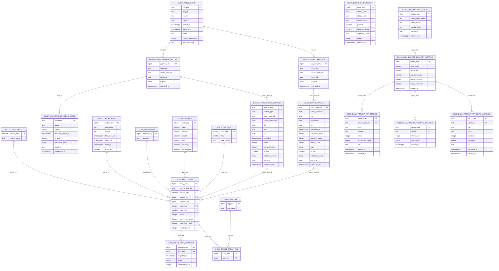

# Entity Relationship Diagram

This ERD represents the main Tech News warehouse tables across Audit, Bronze, Silver, and Gold layers.

```mermaid
erDiagram
    AUDIT_PIPELINE_RUN {
        bigint run_key PK
        text dag_id
        text run_id
        uuid batch_id
        timestamptz started_at
        timestamptz finished_at
        text status
        integer records_processed
        text error_message
    }

    AUDIT_DATA_QUALITY_RESULT {
        bigint result_key PK
        date check_date
        text check_name
        text source_name
        boolean passed
        numeric observed_value
        text expected_value
        jsonb details
        timestamptz checked_at
    }

    AUDIT_DAILY_PIPELINE_STATUS {
        date status_date PK
        text hackernews_status
        text devto_status
        text quality_status
        text message
        timestamptz checked_at
    }

    BRONZE_HACKERNEWS_PAYLOAD {
        bigint payload_key PK
        text endpoint
        text source_item_id
        uuid batch_id
        jsonb payload
        timestamptz ingested_at
    }

    BRONZE_DEVTO_PAYLOAD {
        bigint payload_key PK
        text endpoint
        text source_item_id
        uuid batch_id
        jsonb payload
        timestamptz ingested_at
    }

    SILVER_HACKERNEWS_CONTENT {
        text source_item_id PK
        text content_type
        text parent_item_id
        text author_username
        text title
        text text
        text url
        timestamptz posted_at
        integer score
        integer comments_count
        boolean is_valid
        array validation_errors
        uuid batch_id
        timestamptz processed_at
    }

    SILVER_HACKERNEWS_USER_PROFILE {
        text username PK
        text about
        integer karma
        timestamptz account_created_at
        boolean is_valid
        array validation_errors
        uuid batch_id
        timestamptz processed_at
    }

    SILVER_DEVTO_ARTICLE {
        text source_item_id PK
        text author_username
        text title
        text description
        text url
        timestamptz published_at
        integer comments_count
        integer reactions_count
        integer reading_time
        array tags
        boolean is_valid
        array validation_errors
        uuid batch_id
        timestamptz processed_at
    }

    GOLD_DIM_SOURCE {
        smallint source_key PK
        text source_name
    }

    GOLD_DIM_AUTHOR {
        bigint author_key PK
        text username
        text source
        timestamptz first_seen_at
        timestamptz valid_from
        timestamptz valid_to
        boolean is_current
    }

    GOLD_DIM_DOMAIN {
        bigint domain_key PK
        text domain
    }

    GOLD_DIM_DATE {
        integer date_key PK
        smallint year
        smallint quarter
        smallint month
        smallint day
        smallint weekday
        boolean is_weekend
    }

    GOLD_DIM_TIME {
        smallint hour_key PK
        smallint hour
        text time_of_day
    }

    GOLD_DIM_TAG {
        bigint tag_key PK
        text tag_name
    }

    GOLD_FACT_STORY {
        bigint story_key PK
        text source_item_id
        smallint source_key FK
        bigint author_key FK
        bigint domain_key FK
        integer date_key FK
        smallint hour_key FK
        integer score
        integer comments_count
        integer reactions_count
        integer reading_time
    }

    GOLD_FACT_STORY_SNAPSHOT {
        bigint snapshot_key PK
        bigint story_key FK
        timestamptz snapshot_at
        integer score
        integer comments_count
    }

    GOLD_BRIDGE_STORY_TAG {
        bigint story_key FK
        bigint tag_key FK
    }

    GOLD_DAILY_REPORT_TOP_STORIES {
        date report_date PK
        text source_item_id PK
        text title
        text author
        integer score
        integer comments_count
        text url
        timestamptz posted_at
        timestamptz created_at
    }

    GOLD_DAILY_REPORT_TRENDING_DOMAINS {
        date report_date PK
        text domain PK
        integer share_count
        integer total_score
        timestamptz created_at
    }

    GOLD_DAILY_REPORT_TOP_DEVTO_ARTICLES {
        date report_date PK
        text article_id PK
        text title
        text tags
        integer reactions
        integer comments
        text url
        timestamptz published_at
        timestamptz created_at
    }

    GOLD_DAILY_REPORT_SUMMARY_METRICS {
        date report_date PK
        integer story_count
        numeric avg_score
        numeric avg_comments
        integer unique_authors
        integer unique_domains
        timestamptz created_at
    }

    AUDIT_PIPELINE_RUN ||--o{ BRONZE_HACKERNEWS_PAYLOAD : batch_id
    AUDIT_PIPELINE_RUN ||--o{ BRONZE_DEVTO_PAYLOAD : batch_id

    BRONZE_HACKERNEWS_PAYLOAD ||--o{ SILVER_HACKERNEWS_CONTENT : source_item_id
    BRONZE_HACKERNEWS_PAYLOAD ||--o{ SILVER_HACKERNEWS_USER_PROFILE : batch_id
    BRONZE_DEVTO_PAYLOAD ||--o{ SILVER_DEVTO_ARTICLE : source_item_id

    GOLD_DIM_SOURCE ||--o{ GOLD_FACT_STORY : source_key
    GOLD_DIM_AUTHOR ||--o{ GOLD_FACT_STORY : author_key
    GOLD_DIM_DOMAIN ||--o{ GOLD_FACT_STORY : domain_key
    GOLD_DIM_DATE ||--o{ GOLD_FACT_STORY : date_key
    GOLD_DIM_TIME ||--o{ GOLD_FACT_STORY : hour_key

    GOLD_FACT_STORY ||--o{ GOLD_FACT_STORY_SNAPSHOT : story_key
    GOLD_FACT_STORY ||--o{ GOLD_BRIDGE_STORY_TAG : story_key
    GOLD_DIM_TAG ||--o{ GOLD_BRIDGE_STORY_TAG : tag_key

    SILVER_HACKERNEWS_CONTENT ||--o{ GOLD_FACT_STORY : source_item_id
    SILVER_DEVTO_ARTICLE ||--o{ GOLD_FACT_STORY : source_item_id

    AUDIT_DAILY_PIPELINE_STATUS ||--o{ GOLD_DAILY_REPORT_SUMMARY_METRICS : report_date
    GOLD_DAILY_REPORT_SUMMARY_METRICS ||--o{ GOLD_DAILY_REPORT_TOP_STORIES : report_date
    GOLD_DAILY_REPORT_SUMMARY_METRICS ||--o{ GOLD_DAILY_REPORT_TRENDING_DOMAINS : report_date
    GOLD_DAILY_REPORT_SUMMARY_METRICS ||--o{ GOLD_DAILY_REPORT_TOP_DEVTO_ARTICLES : report_date
```